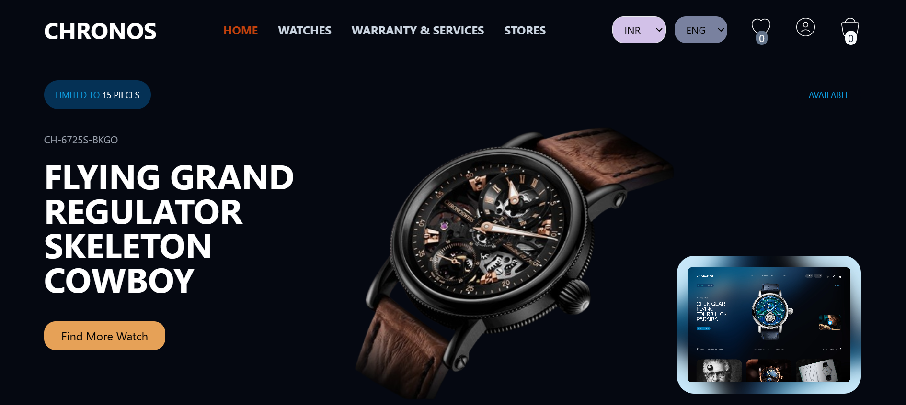

# Chronos



Chronos is a modern e-commerce platform for luxury watches. It offers a seamless shopping experience, allowing users to explore, purchase, and manage their favorite timepieces. The platform includes features like product browsing, warranty services, store locators, and user account management.

---

## Live Links

- **Netlify**: [https://chronos-royal.netlify.app/](https://chronos-royal.netlify.app/)
  _(Deployed on Netlify for faster performance)_

- **Vercel**: [https://chronos-royal-watch.vercel.app/](https://chronos-royal-watch.vercel.app/)
  _(Alternative deployment on Vercel)_

---

## Features

### Pages

1. **Home**

   - A visually stunning landing page showcasing featured products and promotions.

2. **Watches**

   - Browse a wide range of luxury watches with filters and sorting options.

3. **Warranty & Services**

   - Manage warranty details, transfer ownership, and extend support services.

4. **Stores**

   - Locate nearby stores with an interactive map and store details.

5. **User**

   - User account management, including profile, orders, and preferences.

6. **Cart**

   - Add, remove, and manage items in your shopping cart.

7. **Single Product Page**

   - Detailed view of each product with high-resolution images, descriptions, and reviews.

8. **Favorite**
   - Save your favorite watches for quick access.

---

## Technologies Used

- **Frontend**: React.js, Tailwind CSS, Hugeicons-React
- **Backend**: (Add your backend technology, e.g., Node.js, Express, MongoDB)
- **Deployment**: Netlify, Vercel
- **Other Tools**: Git, GitHub, Figma (for design)

---

## Why Netlify?

Netlify was chosen for deployment due to its **fast build times** and **global CDN**, ensuring a smooth user experience. However, there are occasional issues with **image and video loading**, which are being investigated and optimized.

---

## Installation

To run this project locally, follow these steps:

1. **Clone the repository**:

   ```bash
   git clone https://github.com/nikhil-dev-395/chronos---watch-e-commerce-app.git

   ```

   note - if you have any suggestion for me your can directly contact me
